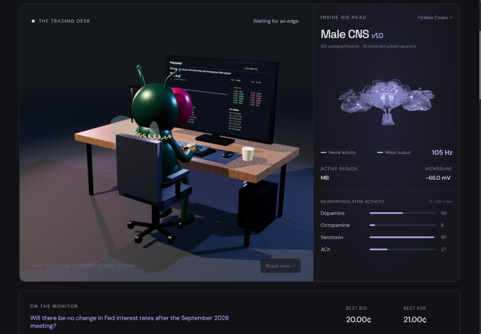

# The Degeneret Fly

A little instinct. A lot of market.

you can see him live on kick https://kick.com/degenaratefly

**Built by Robin-kevin Vettik.** Software copyright and MIT license holder: **Robillionair OÜ**.

A green, gold-wearing 3D fruit fly watches a live Polymarket workstation. Beside him, reconstructed MaleCNS anatomy carries branching light pulses from a leaky integrate-and-fire circuit. Order flow becomes sensory input; predictions become lessons; accepted decisions are saved in his shared local $100 ledger.



## Run locally

Requires Node.js **20.19+ or 22.12+** and npm. No wallet, API key, account login, or Python setup is needed.

```bash
git clone https://github.com/Rob-bio4/degeneretfly.git
cd degeneretfly
npm ci
npm run dev
```

Open **http://localhost:4173/**. Keep the terminal open. Stop with Ctrl+C.

For the optimized build:

```bash
npm run check
npm start
```

`npm run check` runs seventeen automated tests, TypeScript checking, and the production build. `npm start` serves the generated `dist/` with the same public-data proxy. Default binding is loopback only. Override `PORT` if 4173 is occupied. Do not run development and production servers on the same port.

For Kokoro **Adam**, local **Qwen 2.5 0.5B Q4**, and sequential Kick replies, follow [Streamer setup](docs/STREAMER-SETUP.md). Start with `npm run setup:models`, then click **Enable Adam** in the app. For genuine body-to-body synapse extraction through the official API, follow [Phase 1: MaleCNS connectivity](docs/CONNECTOME.md). That optional extraction requires Python and a neuPrint token; ordinary viewing does not.

## The story

### 1. He senses the order book

The local server discovers active YES contracts through Polymarket Gamma. It favors recent trading volume, excludes near-resolved prices, and verifies a two-sided CLOB book before selecting a contract. A rolling 24-contract watchlist reads six books concurrently every two seconds (slower on network delays), and moves through the discovery pool in four-minute blocks. This gives each window time to collect observations and score delayed predictions. The monitor changes focus approximately every twenty seconds, prioritizing fresh, warmed candidates by estimated edge less spread. Open positions retain focus. This is bounded discovery, not simultaneous coverage of the entire exchange.

Actual top-five depth imbalance, a full minute of observed midpoint velocity, and changes in spread become effective membrane-driving inputs. There are no price generators. An unavailable or stale feed pauses decisions. A newly selected market must accumulate sixty seconds of observations.

### 2. His circuit fires

`requestAnimationFrame` advances a fixed 8.333 ms LIF integration step. Membrane potentials leak toward rest, incoming synaptic impulses change voltage, and threshold crossings produce spikes followed by a refractory interval. Antennal-lobe and optic channels feed Central Complex/Mushroom Body abstractions, then descending output channels.

The visible anatomy comes from the public **MaleCNS v1.0** release. The application ships 90 anatomical compartment meshes and 42 sampled SWC skeletons, including DNge104_R body `12781` and DNge104_L body `556329`. One sampled skeleton has no segments inside the displayed brain bounding box, so the viewer reports **41 visible reconstructed neurons**. All coordinates share one anatomical frame; SWC coordinates are converted from 8 nm voxels to nanometers. Compartment edges are precomputed without repositioning individual structures.

Important distinction: this is authentic reconstructed **morphology**, not the entire connectome's connectivity. The ten-channel functional circuit and its thirteen synaptic links are authored abstractions, not an imported body-to-body synapse table. Its labels are functional channel names, not validated MaleCNS root IDs. Light pulses depict model activity over anatomical branches, not recordings of a living fly. The compact activity overlay does not localize activity to an individually verified biological neuron.

Acetylcholine is assigned positive weights; GABA and glutamate receive negative weights in this circuit. These are modeling choices: biological transmitter effects depend on receptor and cell context. The displayed mV values are model voltages. Violet branching light marks neural activity; green marks descending activity. There are no particle-orb representations.

### 3. He learns from what happened next

Once the observation window is ready, the learner stores a feature vector and a predicted sixty-second price change at most every ten seconds per token. Only a later, same-token observation can score that prediction. A bounded online gradient update adjusts three feature weights. Display-focus switches preserve token-specific background observations; samples older than 75 seconds expire unscored rather than borrowing another contract's outcome.

This teaches a small price-response model, not language understanding or guaranteed trading skill. There is no historical training corpus, news analysis, or claim of profitability. The lesson counter shows actual completed prediction evaluations. Weights and completed lessons persist on the local server across browser sessions.

### 4. A decision must earn its place

A descending spike can request a fill, but execution checks must also pass: fresh quote, completed warmup, seven-second cooldown, sufficient cash/inventory, healthy storage, and learned edge above the full spread plus a 0.0015 price buffer. A $2 exploration path requires positive observed movement larger than the spread, bid imbalance above 0.45, spread at most 0.005 and at most 2% of ask, and fifteen seconds since the last fill. Faster scanning does not waive these gates.

Exits respond to a predicted negative edge, a bid decline from entry bid exceeding the larger of 0.003 or 4% of cost, an executable profit above the larger of 0.002 or 1.25 spreads, or a three-minute maximum hold. The stop no longer treats the initial spread as immediate adverse price movement. Legacy positions without entry-bid metadata use their stored cost. Intent drives the authored descending channels; their threshold crossings gate fills, not the language model.

### Why the earlier ledger showed zero wins

The reviewed ledger contained 18 exits, no profitable exits and approximately $1.34 realized loss. Repeated entries at $0.21 followed by timed exits at $0.20 lost about $0.095 on 9.52 shares, even with zero slippage. The permissive imbalance-only exploration rule and one-minute forced exit repeatedly paid the spread without favorable movement. The revised gates target that specific churn. Past losses are preserved; neither faster scanning nor these changes demonstrate profitability. Fees remain unmodeled, so displayed performance can still be optimistic.

Buys walk actual ask depth, sells walk actual bid depth. A buy is limited to $8 and fifteen shares, with no borrowing or shorting. Slippage is the depth-weighted fill's deviation from the best executable quote. Cash plus inventory marked at the last observed bid produces equity. Closed-win percentage counts profitable sell fills, not resolved market outcomes. Fees, queue position, settlement, and fill competition are not modeled.

The **Fly history** is a local execution ledger, not exchange-confirmed orders. It starts with $100, never sends an order or accesses a funded wallet, and saves fills to the local server's ignored `.runtime/ledger.json`. **Polymarket tape** is a separate read-only feed of public exchange trade reports. This separation keeps the character's decisions distinct from other traders' transactions.

## Anatomy, mood and chemistry

The panel exposes dopamine, octopamine, serotonin and acetylcholine as **dimensionless 0–100 activity indices**, not measured concentrations. Dopamine responds to prediction error and realized outcome; octopamine reflects volatility/spread arousal; serotonin represents restraint; ACh reflects sensory drive. These are explanatory state variables, not calibrated neurochemical physiology. Cortisol is deliberately not used as a fly stress readout; octopamine is the relevant insect-inspired channel.

The character is a procedural Three.js interpretation of the supplied character sheet: green chitin, faceted magenta eyes, antennae, proboscis, transparent wings, articulated limbs, and gold jewelry. It is fully volumetric and orbitable, not a flat image or an exact production sculpt of the reference.

## The science behind the streamer

The meme is the character; the scientific foundation is connectomics, computational neuroscience and online prediction. These layers have different evidential status.

### Reconstructed anatomy, not a living brain recording

Electron-microscopy connectomics reconstructs neuronal shapes and identifies synaptic contacts. The shipped MaleCNS v1.0 skeletons and compartment geometry come from the official anatomical release. A skeleton describes a neuron's branching shape; a connectome adds directed connections between cells. Neither by itself tells us the voltages, thoughts or hormone concentrations of an animal. See the [official MaleCNS data and methods resources](https://male-cns.janelia.org/download/).

The Phase 1 extractor uses Janelia's official neuPrint API to request contacts among the visible bodies, with synapse counts, pre/postsynaptic coordinates and available neurotransmitter predictions. It records provenance and validates counts before exporting. This export requires authenticated access and is not yet wired into the running circuit. The current ten-channel LIF network is an authored abstraction over authentic morphology, not the complete MaleCNS network. See [the extraction guide and scientific boundaries](docs/CONNECTOME.md).

### From market measurements to spikes

The computational experiment encodes order-book imbalance, observed sixty-second price velocity and spread compression as sensory drive. A leaky integrate-and-fire neuron accumulates that drive while its membrane state relaxes toward rest. Crossing a threshold produces a discrete spike and a refractory interval. Fixed 8.333 ms steps make this model independent of ordinary rendering-rate variation; stale data does not trigger catch-up trades.

This is an engineered encoding, not evidence that a biological fly understands markets. The character's eyes and head face its monitor, but the current engine receives numerical market features rather than reconstructing the animal's retinal processing. The branching lightning illustrates model activity; it is not a measured action potential traveling through each displayed biological cell.

### Learning from delayed outcomes

The learner predicts a future midpoint change from three market features. Once a fresh observation from the same contract arrives approximately sixty seconds later, it calculates `error = observed change - predicted change` and updates each feature weight by a bounded gradient step proportional to that error and feature value. The lesson counter counts completed comparisons, not elapsed time or invented experience. Missing observations and market switches cannot become cross-contract training examples.

Execution and learning are related but separate: a descending model spike gates an eligible ledger fill, while prediction errors update the predictor. Positive realized trade PnL raises the modeled dopamine reward index; losses lower it. That reward currently affects expressive state, not a biologically validated dopamine-dependent synaptic-plasticity rule. There is no claim that this small predictor will become profitable, and spread costs can dominate its results.

### Neuromodulators as an animation interface

Dopamine, octopamine, serotonin and acetylcholine are named biological signaling systems, but their displayed levels here are dimensionless computational indices. Volatility and spread drive the octopamine-inspired arousal signal, sensory pressure drives ACh, and a restraint index drives serotonin. These values modulate head motion, typing, wing flutter and expressive nods. They are not assays or calibrated physiological concentrations.

The proposed conductance-based network, exact contact-localized propagation, and E/I–flux–synchrony stress score belong to subsequent phases. Transmitter identity alone cannot establish receptor-dependent excitation or inhibition. Gamma-band analysis up to 80 Hz also needs a higher internal sampling rate than the current 120 Hz step. Any future stress or overdrive indicator must remain a model readout, not a diagnosis of seizure or tissue damage.

### What would count as stronger evidence?

An authenticated, reproducible connectivity export; a justified sensory-to-descending-neuron subcircuit; parameter and timestep sensitivity tests; comparisons against simple trading baselines on held-out data; and explicit accounting for fees and execution constraints. Anatomical authenticity does not establish functional fidelity or trading skill. The project's purpose is to make those distinctions visible while creating an entertaining, inspectable streamer.

## History and controls

- Drag the desk or brain to orbit. Scroll over the desk to zoom. **Reset view** restores the camera.
- **Pause decisions** stops neural decisions while live data and rendering continue.
- Fly history is paginated without discarding fills. **Export fly history** downloads ledger and learning state as JSON.
- The public tape starts with the latest 100 reports, then merges further ten-second Data API polls by transaction identity. It is a session collection, not all historical Polymarket activity; more than 100 trades between polls may leave gaps.
- History and weights are shared by browsers using this same local server. Clearing browser data does not erase the server ledger. Back up `.runtime/ledger.json` or use Export regularly; deleting the project/runtime directory does erase it.
- A background/hidden browser may throttle animation and data timers. No catch-up trading occurs when it returns.

## Architecture

### Local persistence and ownership

On first startup, the first browser migrates its existing localStorage history into `.runtime/ledger.json`. Open your existing desk first when upgrading; a later browser cannot overwrite an established server ledger with its own older history. Files in `.runtime/` are ignored by Git and denied as static downloads. Each save uses an atomic replacement and monotonic revision; historical fills are append-only.

The primary browser renews a twelve-second write lease every two seconds. Other browsers display the saved ledger without running a second learning/trading writer. After the primary closes, another open browser can take over when that lease expires. A storage/network failure pauses decisions. New fills request an immediate save; an interrupted in-flight save or sudden process failure can still lose changes since the last acknowledgment (normally up to the two-second checkpoint). Pending, unscored observations are rebuilt after a reload. This is local persistence, not a cloud service or always-running headless trader.

### Expressive animation

Negative realized exits trigger a two-beat tabletop slam; profitable exits trigger raised arms, nods and excited wing motion. Neutral exits do not pretend to be wins or losses. Idle choreography alternates leaning toward the monitor and antenna grooming, with mood-scaled typing and head movement between gestures. Occasional “Hey chat” greetings trigger a wave at actual audio playback start. Speaking expands mouth/proboscis motion and head nods. These gestures never manufacture a trade, reward or lesson. In development only, `?choreography` exposes isolated animation preview buttons for QA.

| File | Responsibility |
| --- | --- |
| `server.mjs` | Local Vite/static server; fixed-host public API proxy; bounded timeouts and short cache |
| `src/live-market.ts` | Discovery, sorted CLOB depth, websocket book updates, REST recovery and trade reports |
| `src/connectome.ts` | LIF functional circuit, neurotransmitter weights, delays and refractory state |
| `src/agent.ts` | Delayed online learning, risk gates, depth-aware ledger, persistence |
| `src/character.ts` | Procedural volumetric fly and jewelry |
| `src/studio.ts` | Desk, monitor texture, lighting, cameras and animation |
| `src/anatomy.ts` | Real anatomical outlines, SWC branches and traveling-light shader |
| `src/app.ts` | HUD, complete local fill history, export, controls and render loop |
| `public/data/anatomy.json` | Exact source manifest, body IDs, units and provenance |
| `scripts/fetch-anatomy.mjs` | Re-download public anatomical assets |
| `scripts/prepare-anatomy.mjs` | Precompute derived mesh-edge buffers for fast startup |

The asset files are included so normal startup does not require downloading the connectome again. To regenerate:

```bash
node scripts/fetch-anatomy.mjs
node scripts/prepare-anatomy.mjs
npm run build
```

## Live data and safety

The server permits only read-only requests to hardcoded Gamma, CLOB and Data API hosts. It validates token/condition identifiers, bounds requests to ten seconds, and does not accept arbitrary proxy URLs. It has no private-key handling or order submission code. Do not expose the development server publicly. A public deployment needs HTTPS, abuse/rate controls, operational monitoring and a durable per-user store.

Websocket books supplement three-second CLOB polling; REST remains active if the websocket is unavailable. The quote-age indicator is time since receiving a valid book, not the exchange's last trade time. Current holdings in other contracts retain their last observed marks until those contracts are selected again; this is not continuous multi-market valuation. The local ledger does not enforce every exchange venue constraint, such as market-specific minimum order sizes.

If a feed is unavailable, confirm Internet access and inspect `/api/health`. The monitor and status show waiting/stale states until genuine data returns. If anatomy is missing, regenerate assets using the commands above. WebGL2 must be enabled with hardware acceleration for the best experience.

## Streaming

Open **http://localhost:4173/?stream=1** for the dedicated, letterboxed **16:9** composition. The large desk camera shows the fly and its monitor; the inset renders the same animated 3D fly from a separate front-facing camera. The right column contains brain telemetry and the scrollable execution journal. Quotes, ledger totals, speech captions, connection status and credits remain inside the frame. The face camera is capped at 24 fps to reduce the additional rendering cost.

The character continuously cycles through fifteen expressive gestures, with short transitions: outcome reactions, greeting wave, grooming, leaning, pointing, shrugging, clapping, head bobbing, stretching, drumming, facepalm, looking around, wing flexing and antenna touch. Its baseline typing and breathing continue between gestures. Animation remains active while the strategy waits; trading still pauses on stale data or storage failure. Speech is sequential with a shorter inter-turn gap, but model inference, autoplay permissions and outages can still cause silence.

For OBS: add a Browser Source, URL above, **width 1920 / height 1080**. Use **Interact → Enable Adam voice**, capture that source's audio, and avoid capturing it a second time via desktop audio. Keep the source active. Enable voice in just one browser to avoid duplicated speech. A read-only stream view can announce newly saved fills from the primary trader without creating duplicate orders. See [Kick + voice connection instructions](docs/STREAMER-SETUP.md).

Use an OBS browser source pointed at the local URL, preferably 1920×1080 or larger. Start the local server before opening OBS. Browser sources need permission to access loopback. Keep the source active to preserve observation continuity. The site is responsive; the history and narrative continue below the main scene.

## Academic and institutional credits

- **The FlyWire Consortium** — connectomics and the Codex ecosystem.
- **Princeton University: Murthy Lab and Seung Lab** — FlyWire scientific contributions.
- **MRC Laboratory of Molecular Biology (LMB), Cambridge** — connectomics and MaleCNS collaboration.
- **HHMI Janelia Research Campus, FlyEM team** — specifically the **MaleCNS v1.0 dataset** and public anatomical release.
- **University of Cambridge Department of Zoology** and **Google Research** — MaleCNS dataset collaborators.
- **Polymarket** — Gamma, CLOB and Data APIs.

Primary sources: [MaleCNS downloads and licensing](https://male-cns.janelia.org/download/), [FlyWire Codex MCNS explorer](https://codex.flywire.ai/?dataset=mcns), [Polymarket documentation](https://docs.polymarket.com/). The Codex explorer and Janelia releases may expose different dataset versions; this repository's downloaded assets explicitly use Janelia v1.0. Institutional credit does not imply endorsement.

## License

Code: **MIT License, copyright 2026 Robillionair OÜ**, exclusively. See [LICENSE](LICENSE).

Anatomical meshes, skeletons, and derived outlines retain the upstream **CC-BY-4.0** license; MIT does not relicense that data. See [data attribution](public/data/ATTRIBUTION.md) and the source manifest. Third-party libraries retain their respective licenses.
